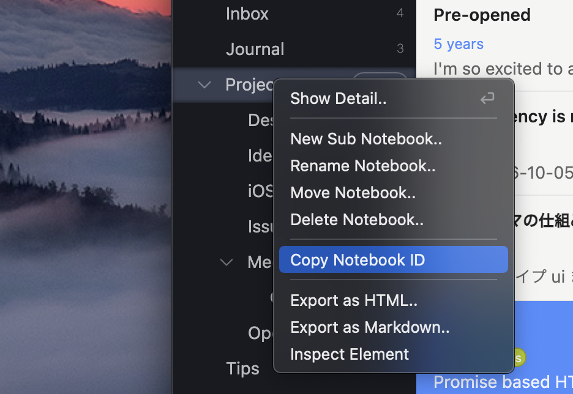
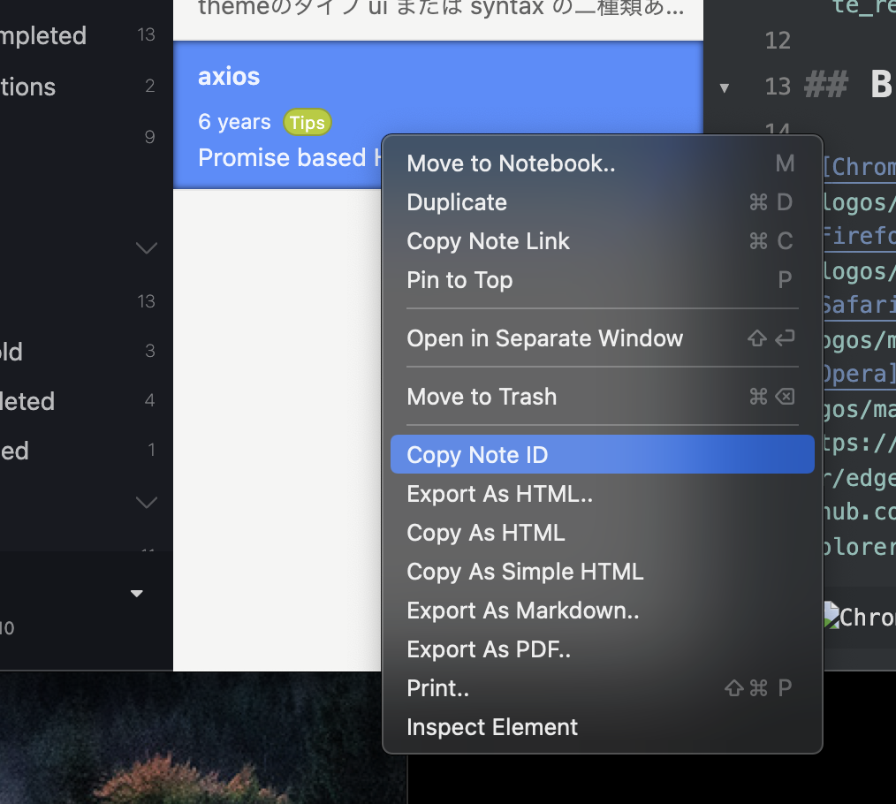
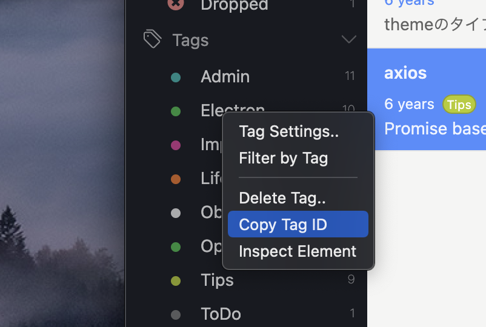
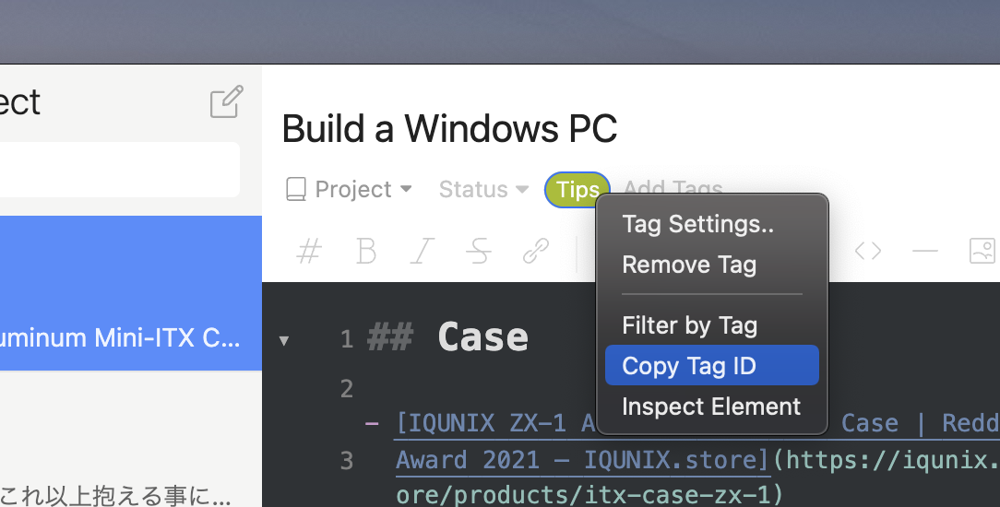

Developer tools for Inkdrop
===========================

Adds some useful features for hacking Inkdrop.

## Install

```sh
ipm install dev-tools
```

## Copy data ID

Copying a notebook ID from the sidebar context menu:



Copying a note ID from the sidebar context menu:



Copying a tag ID from the sidebar context menu:



Copying a tag ID from the editor context menu:



